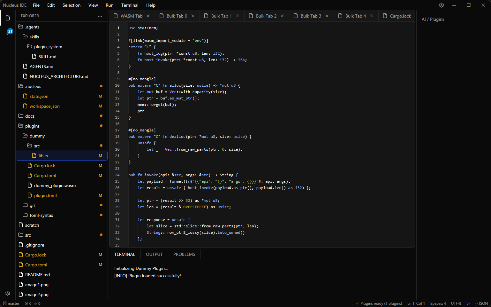
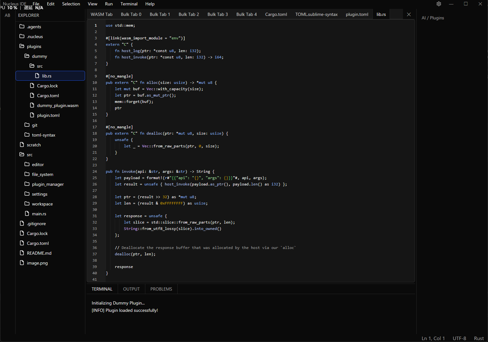

<div align="center">

# ⚛️ Nucleus

**Next-Generation, Blazing Fast Native Code Editor built with Rust, GPUI & WebAssembly**

*Core層はシンプルに、爆速に。機能はプラグインで無限に拡張可能ーーNucleus Editor*

[](https://www.rust-lang.org/)
[](https://github.com/zed-industries/zed)
[](https://wasmtime.dev/)
[](#)
[](#)

<br/>

<p align="center">
  
  
</p>

</div>

---

## 🌟 主な特徴 (Features)

### ⚡ 圧倒的な描画パフォーマンス & Zero UI Thread Blocking
- **GPU アクセラレーション (GPUI & `gpui-component`)**: 60fps+ のスムーズなネイティブレンダリング。
- **Zero-Cost State Sharing & ゼロ I/O ツリー描画**: 描画ループ内の同期ディスク I/O (`stat`) を完全排除。
- **リアルタイム Performance HUD**: ステータスバー右端にフレーム描画時間 (ms) と FPS を常時表示 (`⚡ 0.8ms (60 FPS)`)。
- **Rope テキストエンジン (`ropey`)**: 大規模ファイルでも $O(\log n)$ で軽快に編集。

### 🎨 直感的で洗練されたワークスペース UI
- **エディタタブ横スクロール & ターミナル過去ログ上下スクロール**: マウスホイールで大量のタブや数千行のターミナル出力ログを軽快に閲覧。
- **Master-Detail 設定画面 (Settings View)**:
  - 左側カテゴリサイドバー（Appearance, Editor, Files, Terminal, Languages & LSP, Debug, Git, Plugins）による絞り込み。
  - User / Workspace 設定の即時切り替えと、変更のリアルタイム UI 反映。
  - 日本語 / CJK IME 完全対応のインラインテキスト入力。
- **`Ctrl+P` (ファイル検索) & `Ctrl+Shift+P` (コマンドパレット)**: 高速ファジー検索とキーボードナビゲーション。

### 🧩 競合ゼロの WASM プラグインシステム (Wasmtime)
- **多層 UI マージ合成パイプライン**: 複数プラグイン（例: ファイル別アイコン + Git 変更バッジ）が提供する UI 装飾をホスト側で自動合成し、競合なく 1 つのツリーアイテムに表示。
- **プロセス隔離サンドボックス**: プラグインのパニックやクラッシュがエディタ本体に影響を与えない安全設計。
- **多言語対応**: **Rust**, **Go (TinyGo)**, **TypeScript / JavaScript (Javy)**, **C / C++** でプラグインを開発可能。

---

## 📦 同梱・公式プラグイン (Bundled Plugins)

| プラグイン名 | ディレクトリ | 説明 |
|---|---|---|
| **Git Source Control** | [`plugins/git`](plugins/git) | ブランチ表示、ステージング/変更差分一覧、ツリー変更バッジ連携 |
| **Material Icon Theme** | [`plugins/material_icons`](plugins/material_icons) | 拡張子（`.rs`, `.ts`, `.json`, `.toml` 等）やフォルダごとの美麗なアイコン・カラーを提供 |
| **Japanese Language Pack** | [`plugins/japanese_language`](plugins/japanese_language) | メニュー、設定画面、ステータスバー等 UI 全体の完全日本語化辞書 |

---

## 🏗️ アーキテクチャ概要

Nucleus はドメイン駆動の垂直スライス（Domain-Driven Vertical Slice）アーキテクチャを採用しています。

```
Nucleus (Host)
├── GPUI + gpui-component (GPU レンダリング & UI)
├── Workspace
│   ├── ActivityBar / LeftSidebar (Explorer, Git, Search, Plugin Views)
│   ├── EditorArea (Tabs with Scroll, SettingsView, KeybindingsView)
│   ├── BottomPanel (Terminal with Scrollback, Problems, Debug Console)
│   ├── CommandPalette (File Finder & Command Search)
│   └── StatusBar (Git Branch, Position, Encoding, Performance HUD)
├── Core Editor Engine
│   ├── TextBuffer (ropey::Rope, O(log n) 編集, LineEnding)
│   ├── Syntect Highlighting & Bracket Matching & Indent Guides
│   └── Find & Replace Engine
├── Settings System (Hierarchical User / Workspace Store & 40+ Catalog)
└── PluginManager
    ├── Wasmtime Runtime (WASM Sandbox)
    ├── Multi-Plugin UI Merge Pipeline (Decorations, Translations, Icons)
    └── Background Async Offloader (Zero UI Blocking)
```

---

## 🚀 クイックスタート (Getting Started)

### 前提条件 (Prerequisites)
- [Rust](https://www.rust-lang.org/tools/install) (最新の stable または nightly)
- C++ ビルドツール（Windows: Visual Studio C++ Build Tools、Linux: `build-essential`, `libx11-dev` 等）

### 1. リポジトリのクローン & ビルド
```bash
git clone https://github.com/sofia-gros/nucleus.git
cd nucleus

# 通常の起動
cargo run

# リリースビルドでの爆速起動
cargo run --release
```

### 2. テストの実行
```bash
cargo test
```

### 3. ベンチマーク & Flamegraph 生成
```bash
# Criterion マイクロベンチマーク測定
cargo bench --bench benchmarks

# インタラクティブな Flamegraph (flamegraph.svg) の自動生成
cargo run --example generate_flamegraph
```

---

## 📚 ドキュメント & プラグイン開発 (Documentation)

- 📘 **[Plugin SDK 仕様書 (SDK_GUIDE.md)](docs/SDK_GUIDE.md)**: マニフェスト設定、パーミッション、Host API リファレンス
- 🚀 **[多言語プラグイン開発実践ガイド (PLUGIN_DEVELOPMENT_GUIDE.md)](docs/PLUGIN_DEVELOPMENT_GUIDE.md)**: Rust, Go (TinyGo), TypeScript, C/C++ によるプラグイン開発チュートリアル
- 🏗️ **[アーキテクチャ設計原則 (AGENTS.md)](.agents/AGENTS.md)**: Zero UI Thread Blocking, Performance Constraints

---

## 📄 ライセンス (License)

This project is dual-licensed under the **MIT License** and **Apache License 2.0**.
