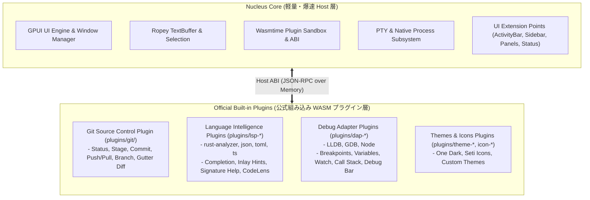

# Nucleus IDE — 完成品配布に向けた全機能要件仕様書 (Release Feature Spec)

> **"Core層はシンプルに、爆速に。機能はプラグインで拡張可能――Nucleus Editor"**

本書は、Nucleus IDE のアーキテクチャ哲学（**極小・爆速の Core 基盤 + WASM 埋め込み公式プラグインによる機能拡張**）に基づき、商用・一般配布レベルの完成品エディタとして必要な全機能要件と、各機能が属するレイヤー（Core 層 vs プラグイン層）の完全な定義です。

---

## 1. コアアーキテクチャ設計

---

## 2. レイヤー別機能要件一覧

### 2.1 Core 層 (軽量・爆速 Host 基盤)

Core 層はエディタの描画性能、タイピング応答速度（ゼロレイテンシ）、ウィンドウ管理に特化し、特定の言語やツールに依存する重厚なロジックを持ちません。

#### 実装済み (Completed)
- [x] **Rope データ構造バッファ (`ropey`)**: 大規模ファイルでもメモリ消費を抑え $O(\log N)$ の爆速編集
- [x] **無制限 Undo / Redo**: 編集履歴ツリー
- [x] **マルチカーソル & 矩形選択**: 複数キャレットの一括編集
- [x] **ソフトラップ (`WrapMap`) & コード折りたたみ (`FoldMap`)**
- [x] **TextMate 構文強調 (`syntect`)**
- [x] **Wasmtime サンドボックス基盤 & プラグイン ABI (`host_invoke`)**
- [x] **UI Extension Points**: Activity Bar, Left/Right Sidebar, Bottom Panel, Status Bar, Title Bar
- [x] **PTY 端末基盤 (`portable-pty`)**: ConPTY / PTY ネイティブセッション管理
- [x] **階層化設定ストア & クラッシュリカバリ**: `settings.json` / `workspace.json`, 自動バックアップ
- [x] **ミリ秒精度起動プロファイラ (`StartupProfiler`)**: 起動時間 < 50ms

#### Core層として実装すべき不足機能 (Remaining for Core)
- [ ] **エディタ内インライン検索・置換バー (`Ctrl+F` / `Ctrl+H`)**: エディタ内オーバーレイ
- [ ] **スプリットエディタ (Split Editor)**: 左右・上下ペイン分割
- [ ] **差分エディタ基盤 (Diff Editor)**: 2つのバッファのサイドバイサイド比較描画
- [ ] **ミニマップ (Minimap)**: ファイル全体プレビュー描画
- [ ] **括弧ペアカラーリング & インデントガイド線**: 視覚的補助線描画
- [ ] **フル ANSI 24bit カラー & VT100 端末エミュレーション**: TUI アプリ完全対応
- [ ] **キーバインド設定 UI & 多言語化 (i18n)**
- [ ] **マルチプラットフォームインストーラー & 自動更新 (Auto-Updater)**

---

### 2.2 公式組み込みプラグイン 1: LSP & 言語インテリジェンス (`plugins/lsp-*`)

言語サーバーとの通信、型推論、補完、ヒントなどの高度な言語機能はすべてプラグインとして完全に隔離・実装します。

#### 実装済み (Completed)
- [x] **LSP クライアント通信基盤 & Language Server プロセス起動**
- [x] **コード補完 (Completion)**: `Ctrl+Space`、アイコン・詳細シグネチャ
- [x] **ホバー情報 (Hover)**: 型定義・Markdown ドキュメント
- [x] **定義へジャンプ (`F12`) & 参照検索 (`Shift+F12`)**
- [x] **シンボルリネーム (`F2`) & Quick Fix (`Ctrl+.`)**
- [x] **ドキュメント自動フォーマット (`Shift+Alt+F`)**
- [x] **Problems パネル & ステータスバーカウンター (`⨂ 0 ⚠ 0`)**

#### プラグインとして拡張する機能 (Remaining in LSP Plugins)
- [ ] **シグネチャヘルプ (Signature Help / `Ctrl+Shift+Space`)**: 引数位置とパラメータヒント
- [ ] **インレイヒント (Inlay Hints)**: 型推論結果や引数名のインライン薄字表示
- [ ] **ドキュメントシンボル (`@`) & ワークスペースシンボル (`#`) 検索**: コマンドパレット連携
- [ ] **セマンティックハイライト (Semantic Tokens)**: 正確な型情報による構文色分け
- [ ] **コードレンズ (CodeLens)**: `▶ Run | Debug` インラインボタン

---

### 2.3 公式組み込みプラグイン 2: DAP & デバッガ (`plugins/dap-*`)

デバッグ実行、ブレークポイント管理、変数追跡はすべて DAP プラグインとして実装し、Core はデバッグ UI Extension Points のみを提供します。

#### 実装済み (Completed)
- [x] **DAP プラグインマニフェスト定義 (`plugins/dap-lldb/`)**

#### プラグインとして実装する機能 (Remaining in DAP Plugins)
- [ ] **DAP クライアント統合**: `lldb-dap`, `gdb`, `codelldb` 等との通信
- [ ] **ブレークポイントガター (Breakpoint Gutter)**: 行番号左側の赤丸（●）トグル
- [ ] **フローティングデバッグバー**: `Continue (F5)`, `Step Over (F10)`, `Step Into (F11)`, `Step Out (Shift+F11)`, `Restart (Ctrl+Shift+F5)`, `Stop (Shift+F5)`
- [ ] **デバッグサイドバーパネル (Run & Debug)**:
  - **VARIABLES**: 変数ツリー
  - **WATCH**: 監視式
  - **CALL STACK**: スタックフレーム一覧
  - **BREAKPOINTS**: ブレークポイント一覧
- [ ] **デバッグコンソール (Debug Console)**: 式評価 REPL

---

### 2.4 公式組み込みプラグイン 3: Git & ソース管理 (`plugins/git/`)

Git 連携は完全なプラグインとして動作し、Git コマンドの非同期実行、差分の計算、UI の動的更新を行います。

#### 実装済み (Completed)
- [x] **Source Control サイドバー (`git status`, `git branch`)**
- [x] **ステージング (`+`), アンステージ (`—`), 変更破棄 (`↺`)**
- [x] **コミット入力 & コミット実行 (`Ctrl+Enter`)**
- [x] **ファイルツリーへの Git ステータスバッジ反映 (`M`, `??`, `A`, `D`)**

#### プラグインとして拡張する機能 (Remaining in Git Plugin)
- [ ] **リモート同期 (Push / Pull / Sync / Fetch)**: ワンクリック同期ボタン
- [ ] **ブランチ作成・切り替え UI**: ステータスバーからのブランチ切り替え
- [ ] **エディタガター差分インジケータ (Gutter Git Decorations)**:
  - 行番号左側の追加（緑）・変更（青）・削除（赤）バー表示
  - クリックによる変更前プレビュー & 巻き戻し
- [ ] **マージコンフリクト解消 UI (Merge Conflict Resolution)**:
  - `<<<<<<< HEAD`, `=======`, `>>>>>>>` のインライン解消ボタン

---

## 3. 実装ロードマップと優先度

1. **Step 1 (Core & Editor Foundation)**:
   - インライン検索・置換バー (`Ctrl+F`), スプリットエディタ, 括弧ペアカラー
2. **Step 2 (Official LSP & Language Plugins)**:
   - シグネチャヘルプ, インレイヒント, シンボル検索 (`@` / `#`), CodeLens
3. **Step 3 (Official DAP Debugger Plugin)**:
   - DAP クライアント, ブレークポイントガター, フローティングデバッグバー, 変数・スタックUI
4. **Step 4 (Official Git Plugin Polish)**:
   - リモート Push/Pull, ブランチ切り替え, ガター差分インジケータ
5. **Step 5 (Distribution & Packaging)**:
   - インストーラー, キーバインドUI, i18n, 自動更新

---

## 4. 開発理念

Nucleus は、「**Core 層は Zed 並みに無駄がなく超高速・シンプル、機能は VSCode 並みにリッチで拡張可能**」という両者の最大の強みを融合したエディタを目指します。
